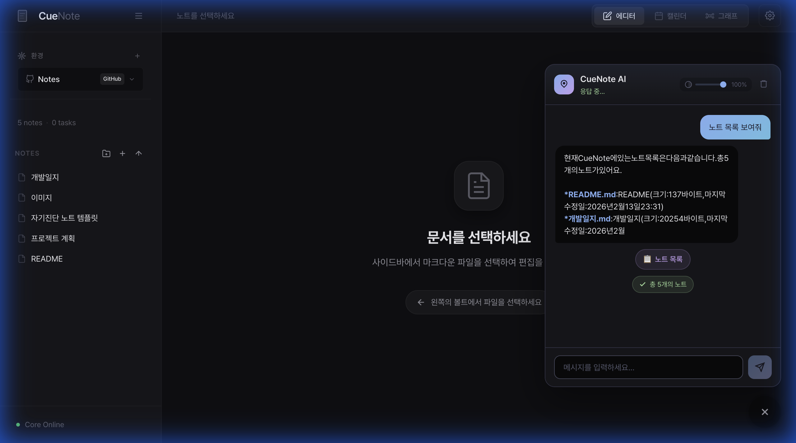
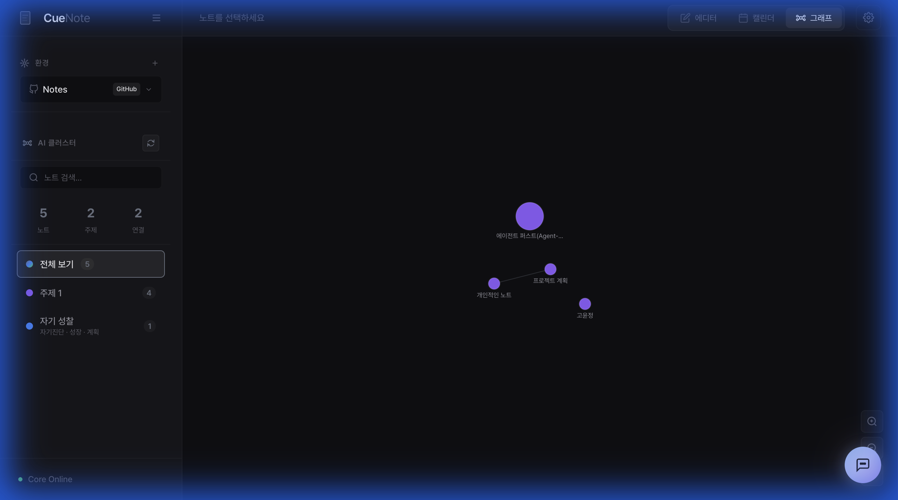
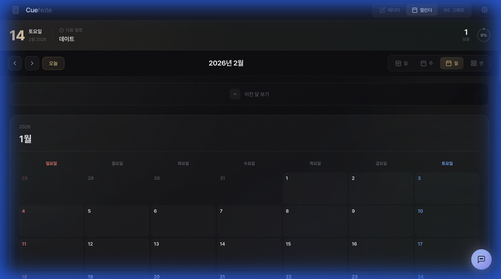

<p align="center">
  
</p>
<p align="center">
  <strong>AI 기반 로컬-우선 마크다운 노트 앱</strong>
</p>

<p align="center">
  <a href="#features">기능</a> •
  <a href="#installation">설치</a> •
  <a href="#usage">사용법</a> •
  <a href="#architecture">아키텍처</a> •
  <a href="#contributing">기여하기</a> •
  <a href="#license">라이선스</a>
</p>

<p align="center">
  
  
  
  
</p>

<p align="center">
  <strong>🇰🇷 한국어</strong> | <a href="README.md">🇺🇸 English</a>
</p>

---

## 🌟 CueNote란?

**CueNote**는 AI 기능이 내장된 오픈소스 프라이버시-우선 데스크톱 마크다운 노트 앱입니다. Electron + Vue 3 프론트엔드와 FastAPI 백엔드로 구성되며, 로컬 LLM(Ollama)부터 클라우드 AI(Gemini, OpenAI, Anthropic Claude)까지 다양한 AI 제공자를 지원합니다.

클라우드 노트 앱과 달리, CueNote는 모든 데이터를 로컬 SQLite 데이터베이스와 마크다운 파일로 관리합니다. GitHub 연동을 통해 선택적으로 클라우드 동기화할 수 있습니다.

<p align="center">
  
  <br />
  <em>CueNote의 AI 기반 노트 편집</em>
</p>

---

## ✨ Features

### 📝 리치 마크다운 에디터
- **WYSIWYG 편집** — Tiptap 기반 리치 텍스트 에디터
- 테이블, 체크리스트, 코드 블록, 이미지 리사이징 등 완전한 마크다운 지원
- 파일 기반 Vault 시스템으로 노트 정리
- 실시간 미리보기 및 편집

### 🤖 AI 글쓰기 어시스턴트
텍스트를 선택하고 우클릭 또는 단축키(`Alt+A`, `/`)로 AI 컨텍스트 메뉴를 열 수 있습니다:

| 기능 | 설명 |
|------|------|
| **요약** | 긴 노트를 핵심 포인트로 요약 |
| **번역** | 7개 이상의 언어로 번역 (마크다운 서식 유지) |
| **다듬기** | 전문적, 캐주얼, 학술적 등 스타일로 문장 개선 |
| **확장** | 내용을 더 상세하게 확장 |
| **축약** | 핵심 의미를 유지하며 간결하게 축약 |
| **맞춤법 교정** | 한국어 & 영어 맞춤법, 문법, 구두점 교정 |
| **직접 요청** | 자유롭게 AI에게 편집이나 작성을 요청 |

- **실시간 스트리밍** — AI 응답이 실시간으로 표시
- **인라인 Diff** — AI 수정 결과를 Diff 형태로 비교하고 수락/거절 가능
- **맞춤법 패널** — 오류를 하나씩 검토하고 개별 적용 가능

<p align="center">
  
  <br />
  <em>실시간 AI 텍스트 분석 및 맞춤법 교정</em>
</p>

### 💬 AI 챗봇 (Tool Calling)
대화형 AI 어시스턴트가 노트 앱의 기능을 자동으로 실행합니다:

- **17개 이상의 내장 도구** — 노트 생성/읽기/저장/삭제, 검색, 일정 관리, TODO 조회 등
- **스마트 검색** — AI가 의미를 이해하여 관련 노트를 찾아줌
- **노트 자동 정리** — AI가 노트 내용을 분석하여 폴더 구조를 제안하고 정리
- **웹 검색** — DuckDuckGo를 이용한 실시간 웹 검색
- **현재 노트 인식** — 열려있는 노트의 내용을 이해하고 관련 작업 수행
- **멀티스텝 실행** — 복잡한 요청을 여러 도구 호출로 자동 처리

<p align="center">
  
  <br />
  <em>AI 챗봇의 Tool Calling — 노트 목록 조회</em>
</p>

### 🔗 GitHub 연동
GitHub 리포지토리와 노트를 직접 동기화:

- **리포지토리 클론/풀** — GitHub 리포지토리를 로컬로 가져오기
- **Git 상태 관리** — 변경된 파일 확인, 스테이징, 언스테이징
- **커밋 & 푸시** — 선택한 파일만 커밋하고 푸시
- **AI 커밋 메시지** — 변경 내용을 AI가 분석하여 커밋 메시지 자동 생성
- **리포지토리 생성** — 앱 내에서 새 GitHub 리포지토리 생성
- **휴지통 관리** — 삭제한 파일 복원 또는 영구 삭제

### 🌐 다중 환경 (Multi-Environment)
여러 작업 공간을 쉽게 전환:

- **로컬 환경** — 로컬 폴더를 Vault로 사용
- **GitHub 환경** — GitHub 리포지토리를 Vault로 사용
- **환경 전환** — 원클릭으로 작업 환경 전환
- 환경별 독립적인 파일 관리 및 설정

### 🕸️ 지식 그래프 (Knowledge Graph)
AI가 노트 간의 관계를 분석하고 시각화:

- **AI 클러스터링** — 노트 내용을 기반으로 자동 그룹화
- **관련 노트 추천** — 현재 노트와 관련된 노트 자동 발견
- **그래프 탐색** — D3.js 기반 인터랙티브 그래프 시각화
- **그래프 검색** — 그래프 내에서 노트 검색
- **클러스터 필터링** — 특정 클러스터만 보기
- **유사도 조절** — 연결 민감도를 슬라이더로 조절

<p align="center">
  
  <br />
  <em>AI 기반 지식 그래프 — 자동 클러스터링 시각화</em>
</p>

### 📅 스마트 캘린더
노트에서 일정을 자동으로 추출하고 관리:

- **AI 일정 추출** — 노트에서 날짜, 시간, 이벤트를 자동 감지
- **상대 날짜 파싱** — "내일", "다음 주 월요일" 등의 표현 이해
- **캘린더 뷰** — 일/주/월/연 단위 캘린더 뷰
- **오늘 포커스 카드** — 오늘의 일정을 한눈에 확인
- **빠른 추가** — 인라인으로 일정 빠르게 추가
- **팝오버 상세보기** — 일정 클릭 시 빠른 상세 정보 확인

<p align="center">
  
  <br />
  <em>캘린더 대시보드 — 오늘 포커스와 일정 개요</em>
</p>

### 📄 문서 & 이미지 처리
- **PDF 텍스트 추출** — PDF 내용을 마크다운으로 변환
- **OCR** — EasyOCR 또는 Gemini Vision을 사용한 이미지 텍스트 추출
- **필기 인식** — TrOCR로 손글씨 인식
- **URL 스크래핑** — 웹 페이지 내용을 자동으로 마크다운 노트로 변환
- **AI 자동 포맷팅** — 추출된 텍스트를 깔끔한 마크다운으로 정리

<p align="center">
  
  <br />
  <em>이미지에서 텍스트를 추출하여 마크다운으로 변환</em>
</p>

### 🔌 MCP (Model Context Protocol) 지원
외부 도구를 연결하여 AI의 능력을 확장:

- **MCP 서버 관리** — 외부 MCP 서버 등록, 시작, 중지
- **도구 자동 발견** — 연결된 서버의 도구를 자동으로 감지
- **도구 호출** — AI 챗봇에서 MCP 도구를 자연어로 실행
- **기본 파일시스템 서버** — 파일시스템 접근 MCP 서버 기본 제공

### 🎨 커스터마이징

#### AI 모델 설정
4가지 AI 제공자를 자유롭게 전환:

| 제공자 | 모델 예시 | 특징 |
|--------|----------|------|
| **Ollama** | Llama 3, Qwen 2.5 등 | 완전 오프라인, 무료 |
| **Google Gemini** | Gemini 2.0 Flash, Gemini 3 Flash 등 | 빠르고 강력, 무료 티어 |
| **OpenAI** | GPT-4o, GPT-4.1, o3 등 | 범용 최강 |
| **Anthropic** | Claude Sonnet 4.5, Claude Haiku 등 | 장문 처리에 강점 |

#### 외형 및 폰트
- **다크/라이트 테마** 전환
- **커스텀 폰트** — 30개 이상의 내장 폰트 + 직접 폰트 파일 추가
- **카테고리별 폰트** — Sans(고딕), Serif(명조), Mono(고정폭) 별도 설정
- **UI 스케일** — 50%~200%까지 UI 크기 조절

#### 단축키
- **커스텀 단축키** — AI 메뉴 등 주요 기능의 단축키 자유 설정
- **다중 단축키** — 하나의 기능에 여러 단축키 등록 가능

#### 다국어
- 🇰🇷 한국어 / 🇺🇸 English 완전 지원

### 🔒 프라이버시-우선 설계
- **100% 로컬 저장** — 모든 노트는 로컬 SQLite 데이터베이스에 저장
- **로컬 LLM 지원** — Ollama를 사용하면 완전 오프라인 AI 사용 가능
- **선택적 클라우드 AI** — 클라우드 AI는 사용자가 직접 선택할 때만 연결
- **텔레메트리 없음** — 어떤 사용 데이터도 수집하지 않음

---

## 🚀 Installation

### 사전 요구사항

- **Node.js** 18+ 및 [pnpm](https://pnpm.io/)
- **Python** 3.11+
- **Ollama** (선택 사항, 로컬 LLM용)

### 빠른 시작

1. **리포지토리 클론**
   ```bash
   git clone https://github.com/Hyun00505/CueNote.git
   cd CueNote
   ```

2. **JavaScript 의존성 설치**
   ```bash
   pnpm install
   ```

3. **Python 의존성 설치**
   ```bash
   pip install -r apps/core/requirements.txt
   ```

4. **앱 실행**
   ```bash
   # 한번에 모두 시작
   pnpm dev:all
   
   # 또는 개별 실행:
   pnpm dev:core     # FastAPI 백엔드 시작
   pnpm dev:desktop  # Electron 앱 시작
   ```

5. **앱 접속**
   - 데스크톱 앱이 자동으로 실행됩니다
   - API: `http://127.0.0.1:8787`

### 선택: Ollama로 로컬 AI 설정

1. [Ollama](https://ollama.ai/) 설치
2. 모델 다운로드 (추천: `llama3.2` 또는 `qwen2.5`)
   ```bash
   ollama pull llama3.2
   ```
3. Ollama 서버 시작
   ```bash
   ollama serve
   ```

### 선택: 클라우드 AI 설정

| 제공자 | API Key 발급 |
|--------|-------------|
| **Google Gemini** | [Google AI Studio](https://makersuite.google.com/app/apikey) |
| **OpenAI** | [OpenAI Platform](https://platform.openai.com/api-keys) |
| **Anthropic** | [Anthropic Console](https://console.anthropic.com/) |

발급받은 API 키를 CueNote 설정에서 입력하세요.

---

## 📖 Usage

### 노트 작성
- 사이드바의 **+** 버튼으로 새 노트 생성
- 노트는 `.md` 파일로 Vault 폴더에 저장
- 마크다운 문법 또는 리치 텍스트 툴바 사용

### AI 글쓰기 도구
- **텍스트 선택** 후 우클릭 또는 `Alt+A` / `/` 키로 AI 컨텍스트 메뉴 열기
- 요약, 번역, 다듬기, 확장, 축약, 맞춤법 교정 중 선택
- 결과가 인라인 Diff로 표시되어 수락/거절 가능

### AI 챗봇
- 사이드바 하단의 챗봇 아이콘 클릭
- 자연어로 명령: "새 노트 만들어줘", "내일 일정 추가해줘", "프로젝트 관련 노트 찾아줘" 등
- AI가 자동으로 적절한 도구를 실행하고 결과를 보여줌

### GitHub 동기화
- 설정에서 GitHub 토큰 연결
- 리포지토리 선택 또는 새로 생성
- Git 패널에서 변경사항 확인, 스테이징, 커밋, 푸시

### 일정 관리
- 노트에 자연스럽게 일정 작성 (예: "금요일 3시에 팀 미팅")
- **AI 일정 추출** 클릭으로 자동 감지
- 캘린더에서 일정 확인 및 관리

### 문서 가져오기
- PDF 파일이나 이미지를 에디터에 드래그 & 드롭
- URL을 입력하여 웹 페이지 내용 가져오기
- 손글씨 모드를 활성화하면 필기 내용도 인식

---

## 🏗️ Architecture

```
CueNote/
├── apps/
│   ├── core/                    # FastAPI 백엔드
│   │   ├── app/
│   │   │   ├── routers/         # API 엔드포인트
│   │   │   │   ├── ai.py        # AI 기능 (요약, 번역, 다듬기 등)
│   │   │   │   ├── chatbot.py   # AI 챗봇 (17+ 도구 호출)
│   │   │   │   ├── github.py    # GitHub 연동
│   │   │   │   ├── graph.py     # 지식 그래프
│   │   │   │   ├── mcp.py       # MCP 서버 관리
│   │   │   │   ├── schedules.py # 일정 관리
│   │   │   │   ├── environment.py # 다중 환경
│   │   │   │   ├── vault.py     # 파일/노트 관리
│   │   │   │   ├── llm.py       # LLM 제공자 관리
│   │   │   │   └── todos.py     # TODO 관리
│   │   │   ├── ollama_client.py   # Ollama API 클라이언트
│   │   │   ├── gemini_client.py   # Gemini API 클라이언트
│   │   │   ├── openai_client.py   # OpenAI API 클라이언트
│   │   │   ├── anthropic_client.py # Anthropic API 클라이언트
│   │   │   ├── mcp_client.py      # MCP 클라이언트 매니저
│   │   │   ├── web_extractor.py   # 웹 콘텐츠 추출
│   │   │   ├── ocr_client.py      # OCR 엔진 (EasyOCR/TrOCR/Gemini Vision)
│   │   │   └── db.py              # SQLite 데이터베이스
│   │   └── data/                  # SQLite 데이터베이스 파일
│   │
│   └── desktop/                   # Electron + Vue 프론트엔드
│       ├── main.js                # Electron 메인 프로세스
│       └── renderer/
│           └── src/
│               ├── components/
│               │   ├── AIChatbot.vue        # AI 챗봇 UI
│               │   ├── AIContextMenu.vue    # AI 컨텍스트 메뉴
│               │   ├── AIInlineDiff.vue     # AI 인라인 Diff
│               │   ├── AIProofreadPanel.vue # 맞춤법 교정 패널
│               │   ├── EditorView.vue       # 에디터 메인 뷰
│               │   ├── GraphView.vue        # 그래프 뷰
│               │   ├── DashboardView.vue    # 대시보드 (캘린더)
│               │   ├── SettingsView.vue     # 설정 뷰
│               │   ├── sidebar/             # 사이드바 (파일, Git, 환경)
│               │   ├── graph/               # 그래프 컴포넌트
│               │   ├── dashboard/           # 캘린더 컴포넌트
│               │   ├── toolbar/             # 에디터 툴바
│               │   ├── settings/            # 설정 탭 (AI, 외형, OCR, MCP, 폰트, 단축키)
│               │   └── editor/              # 에디터 보조 컴포넌트
│               └── composables/             # Vue Composables
│                   ├── useGitHub.ts          # GitHub 연동
│                   ├── useGraph.ts           # 그래프 관리
│                   ├── useChatbot.ts         # 챗봇 관리
│                   ├── useEnvironment.ts     # 환경 관리
│                   ├── useSchedule.ts        # 일정 관리
│                   ├── useSettings.ts        # 설정 관리
│                   ├── useFonts.ts           # 폰트 관리
│                   ├── useShortcuts.ts       # 단축키 관리
│                   ├── useI18n.ts            # 다국어 (한/영)
│                   └── useTiptapEditor.ts    # Tiptap 에디터
│
├── packages/
│   ├── contracts/               # 공유 TypeScript 타입 & 스키마
│   └── shared/                  # 공유 유틸리티
│
└── data/                        # 기본 Vault 위치
```

### 기술 스택

| 계층 | 기술 |
|------|------|
| 데스크톱 쉘 | Electron 28 |
| 프론트엔드 | Vue 3, Vite, Tiptap, D3.js |
| 백엔드 | FastAPI, SQLite |
| AI/LLM | Ollama, Google Gemini, OpenAI, Anthropic Claude |
| OCR | EasyOCR, TrOCR (Transformers), Gemini Vision |
| 도구 프로토콜 | MCP (Model Context Protocol) |
| 버전 관리 | GitHub API, Git CLI |

---

## 🤝 Contributing

기여를 환영합니다! 다음과 같은 방법으로 참여할 수 있습니다:

### 기여 방법
- 🐛 **버그 신고** — 재현 단계를 포함한 이슈 작성
- 💡 **기능 제안** — 디스커션에서 아이디어 공유
- 📝 **문서 개선** — 문서를 더 명확하게 만들기
- 🔧 **PR 제출** — 버그 수정 또는 새 기능 구현

### 개발 환경 설정

1. 리포지토리를 Fork & Clone
2. 기능 브랜치 생성: `git checkout -b feature/amazing-feature`
3. 변경 사항 작성
4. 테스트 및 린팅 실행
5. 명확한 메시지로 커밋: `git commit -m 'Add amazing feature'`
6. Push 후 Pull Request 열기

### 코드 스타일
- 프론트엔드: ESLint + Prettier
- 백엔드: Black + isort
- 커밋 메시지: [Conventional Commits](https://www.conventionalcommits.org/)

---

## 📋 로드맵

- [x] 다중 AI 제공자 지원 (Ollama, Gemini, OpenAI, Anthropic)
- [x] AI 챗봇 (Tool Calling)
- [x] GitHub 연동 및 Git 동기화
- [x] 지식 그래프 및 AI 클러스터링
- [x] MCP (Model Context Protocol) 지원
- [x] 다중 환경 (Multi-Environment)
- [x] 커스텀 폰트 및 UI 스케일
- [x] 다국어 지원 (한/영)
- [x] 커스텀 단축키
- [ ] 플러그인 시스템
- [ ] 모바일 컴패니언 앱
- [ ] 실시간 협업
- [ ] 다양한 포맷 내보내기

---

## 📄 License

CueNote는 [MIT 라이선스](LICENSE)로 배포되는 오픈소스 소프트웨어입니다.

---

## Acknowledgments

- [Tiptap](https://tiptap.dev/) — 헤드리스 리치 텍스트 에디터
- [Ollama](https://ollama.ai/) — 로컬 LLM 런타임
- [FastAPI](https://fastapi.tiangolo.com/) — 모던 Python 웹 프레임워크
- [EasyOCR](https://github.com/JaidedAI/EasyOCR) — Ready-to-use OCR
- [Electron](https://www.electronjs.org/) — 크로스 플랫폼 데스크톱 앱
- [D3.js](https://d3js.org/) — 데이터 기반 시각화

---

<p align="center">
  Made with ❤️
</p>

<p align="center">
  <a href="https://github.com/Hyun00505/CueNote/stargazers">⭐ GitHub에서 Star 주기</a>
</p>
